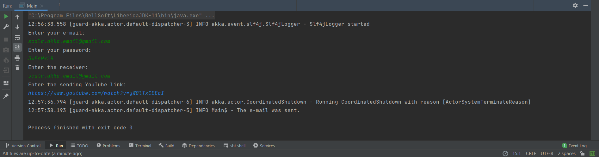
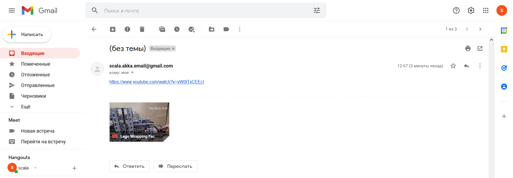
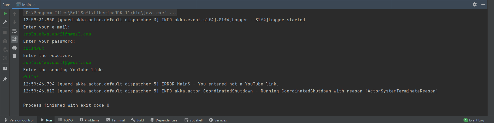
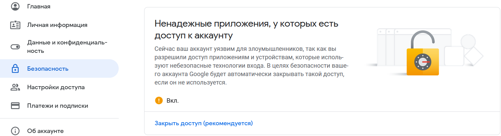

# Scala Akka e-mail sender
## Задание
С помощью Akka реализовать сервис, который должен принимать на вход сообщение (текст, через консоль), проводить валидацию сообщения (проверку на соответствие шаблону, использовать регулярное выражение), и, в случае, если сообщение корректно, отправить его на почту, иначе - не отправлять, но залогировать сообщение об ошибке в консоли.

## Реализация
В основе работы лежит фреймворк Akka. Корневой актор guard собирает данные об отправителе, получателе и тексте сообщения, создает актора отправителя (sender) и отправляет все данные ему. Далее, актор отправитель проверяет посылаемый текст на соответствие регулярному выражению (ссылка на YouTube видео) и в случае если текст проходит проверку, то он отправляется на почту получателю с помощью библиотеки JavaMail и происходит логирование в консоли об успешной отправке. В случае, если текст не проходит проверку на соответствие регулярному выражению, то происходит логирование сообщения об ошибки в консоли. Отправку сообщения следует проводить с Google Mail (@gmail.com).

## Примеры работы
### Успешная отправка сообщения:

### Ошибка при отправке:

## Почта для тестов:
Login: scala.akka.email@gmail.com

Password: 3wEsMxLR
## Примечания:
Для работы приложения необходимо в аккаунте Google в разделе "Безопасноть" разрешить доступ ненадежным приложениям доступ к аккаунту.
